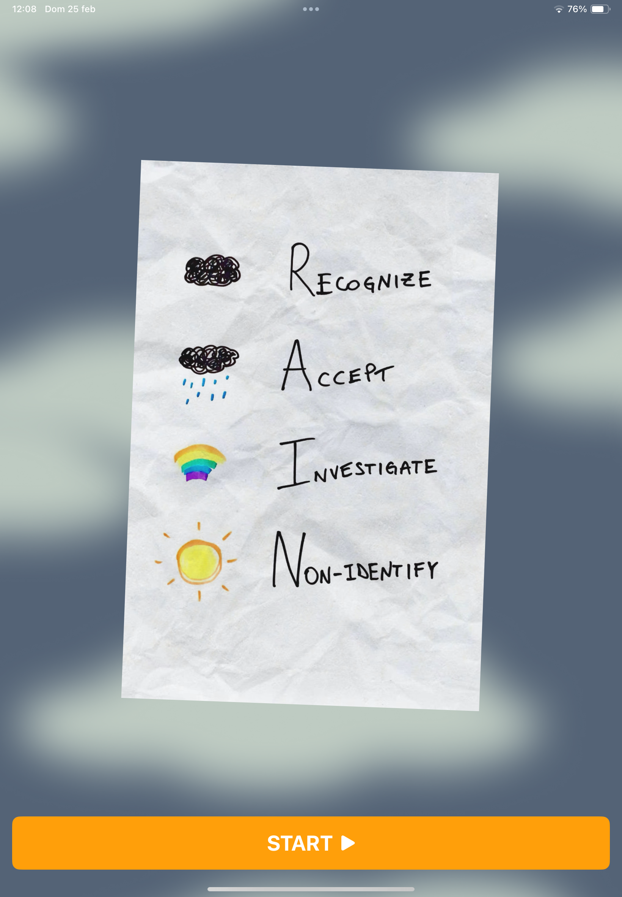
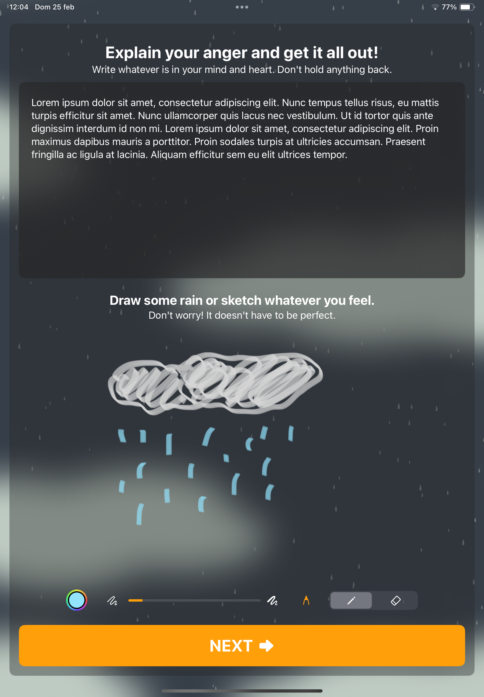
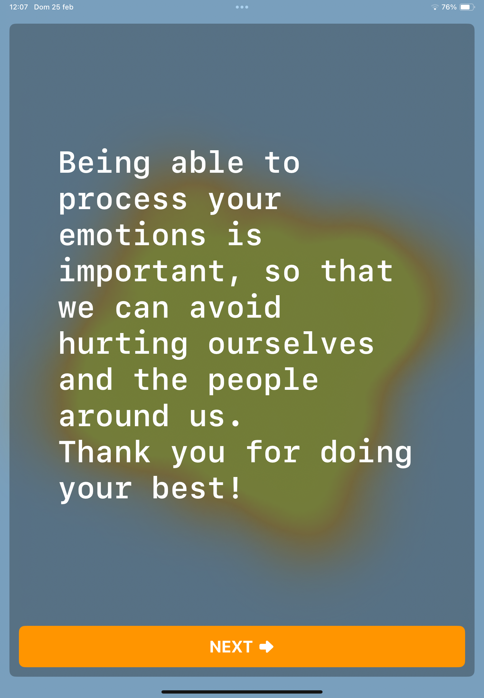
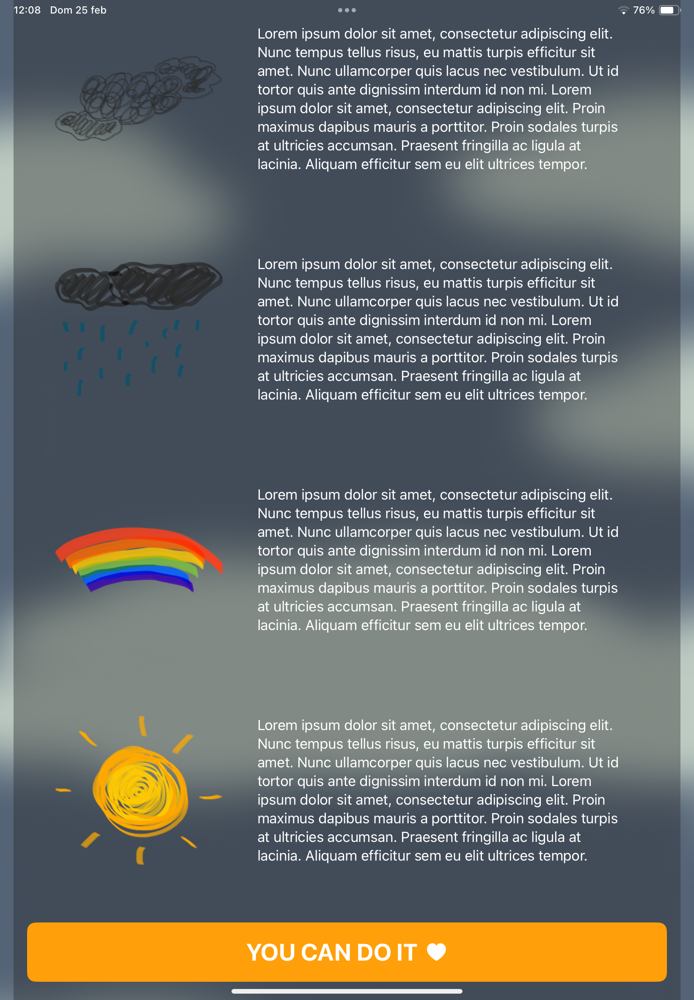

# 🌦️ Rain

Rain is an immersive experience thought as a journal for iPad for processing your emotions to avoid outbursts.

## 🔧 Technologies and Practices

- <b>SpriteKit</b> 
To create the animations.
- <b>AVFAudio</b> 
To play the nature sounds.
- <b>PencilKit</b> 
To let the user draw while journaling.
- <b>MVVM</b> 
To manage seamless navigation and data flow.

  
  
  
  

